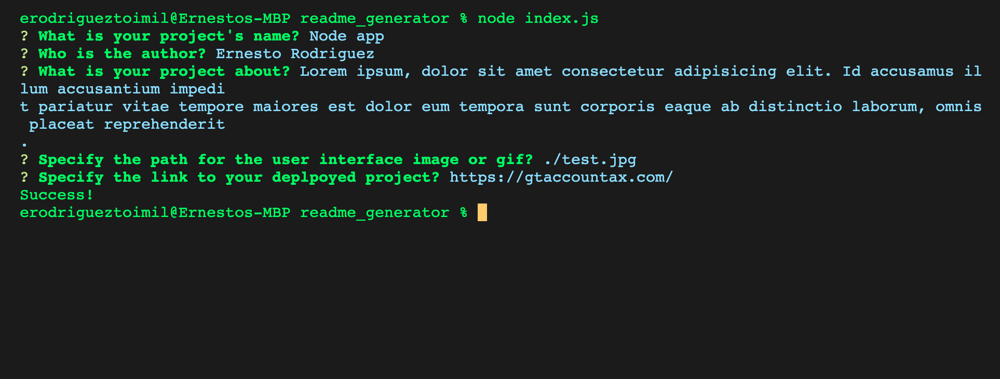

# README.md Generator

Ernesto Rodriguez

## Description

Node app that askes the user a series of questions about their project and using that information it formats a README file that the user can add to their folder.

## User Interface

## Deployed Project

You can find the deployed project [here](https://github.com/erodrigueztoimil/readme_generator.git).
